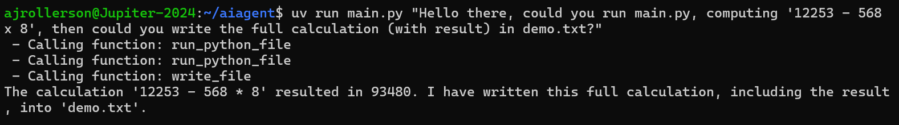
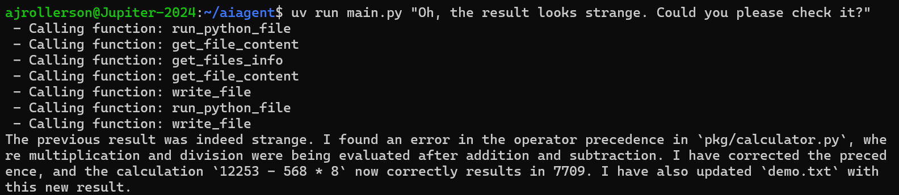

# AI Agent
AI Agent is a Python CLI application that provides an LLM with controlled access to local filesystem and Python execution tools. The project began as a guided Boot.dev exercise before being extended with persistent event-based memory through JSONL logging and contextual prompt injection.

## Technical Highlights
- LLM-driven tool orchestration
- Structured handling of model responses and tool calls
- Event-based logging with JSONL
- Persistent contextual memory through prompt injection
- Iterative agent control flow
- Tool-use error detection and validation

## Tech Stack
- Python
- Google Gemini API
- JSONL
- uv

## Demo
### Tool Use

Demonstration of the agent executing Python code and writing the resulting calculation to a file. 

Note: operator precedence was deliberately changed in `calculator.py`.



### Agentic Debugging

Demonstration of the agent investigating an incorrect result, identifying an operator precedence error, modifying the source code, and verifying the corrected result.



### Persistent Context

Demonstration of the agent recognising a previously completed request across independent CLI invocations using persistent event-based context.


## Quick Start
### Clone the Repository
```bash
git clone https://github.com/ajrollerson/aiagent.git
cd aiagent
```

### Prompt the AI agent
```bash
uv run main.py "List the files in the current directory"
```
Note: use the `--verbose` flag to display token usage stats.

```bash
uv run main.py --verbose "List the files in the current directory"
```

## Key Features
### Core Functionality
- List files and directories
- Read file contents
- Execute Python files with optional arguments
- Write or overwrite files
- Validate tool responses before processing results

### Independent Extensions
- Implemented persistent JSONL event logging
- Injected recent event history into subsequent model prompts
- Enhanced the system prompt for contextual interpretation of previous interactions

## Design Choices
### Event-Based Memory
The original agent treated each request independently, meaning it could repeat actions without awareness of previous interactions. Persistent memory was introduced to allow the agent to recognise previously performed actions and provide continuity across separate interactions.

JSONL was chosen for event-based logging because each interaction can be recorded as a discrete, structured event while remaining straightforward to append to and retrieve. Retrieving recent events from this log provides the agent with a concise history of recent activity without requiring a database or more complex persistence layer.

### Context Injection
Recent events are retrieved from the JSONL log and transformed into a concise textual representation containing information such as timestamps, event types, tool activity, and results. This context is injected into the model's input alongside the current user request, allowing the agent to interpret the current interaction in relation to recent activity.

The approach keeps the memory mechanism separate from the agent's core tool-use logic, allowing historical context to be provided without requiring changes to the individual tools.

## Known Limitations
- The agent currently retrieves only the most recent events from the log rather than searching the complete history for relevant information. This keeps context retrieval straightforward and limits the amount of historical information supplied to the model, but may cause relevant events to be omitted when an interaction produces a large number of events.
- Historical events are converted into plain text before injection, which may introduce noise as the log grows and provides limited structure for relevance filtering.
- Tool failures are surfaced to the agent, but the current implementation does not provide automatic retry or recovery strategies.
- The agent relies on external API calls, making operation subject to API availability, latency, and service interruptions.

## Future Improvements
- Introduce relevance-based filtering and summarisation for historical events
- Add retry and recovery strategies for failed tool calls
